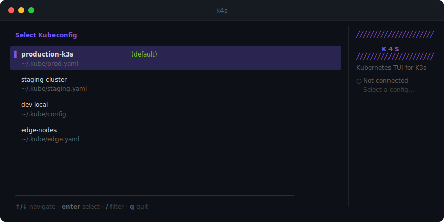
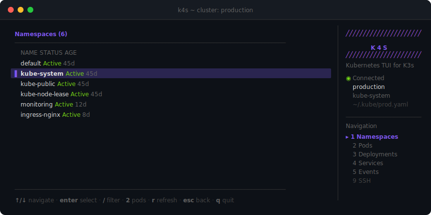
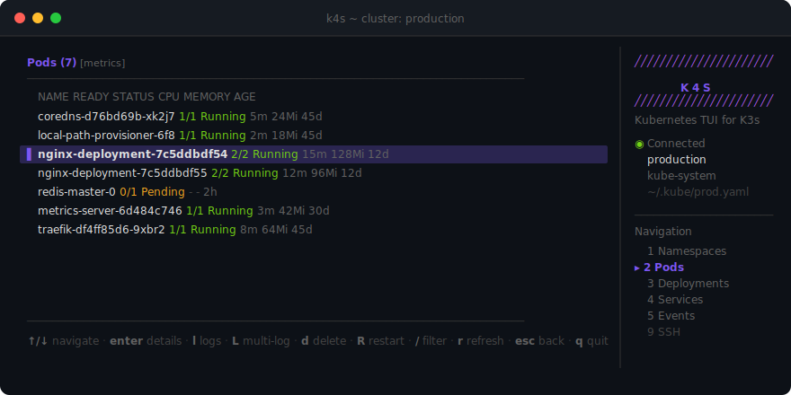
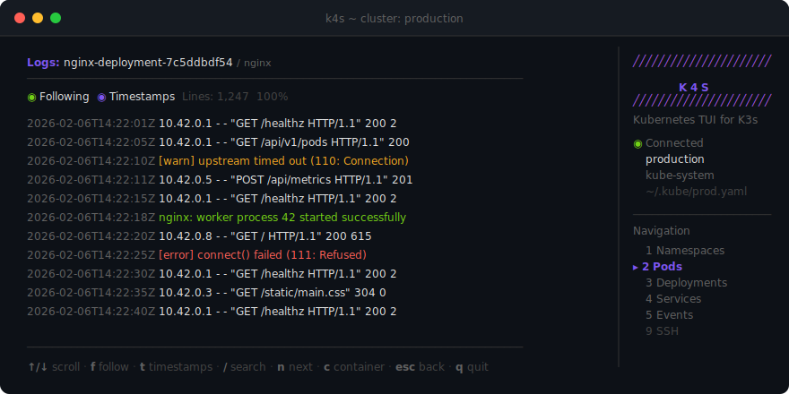
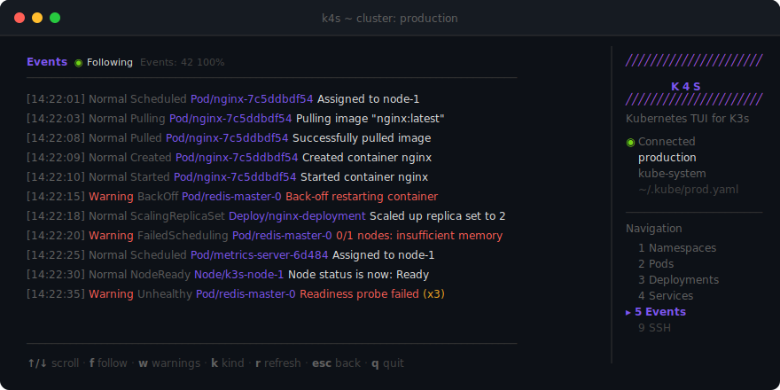

# k4s

A lightweight Terminal UI for K3s/Kubernetes cluster management, built on [Charm](https://charm.sh/).


## Screenshots

<p align="center">
  
</p>
<p align="center"><em>Kubeconfig selector — choose between multiple clusters</em></p>

<p align="center">
  
</p>
<p align="center"><em>Namespaces view with sidebar navigation</em></p>

<p align="center">
  
</p>
<p align="center"><em>Pods view with real-time CPU/Memory metrics</em></p>

<p align="center">
  
</p>
<p align="center"><em>Streaming log viewer with timestamps and search</em></p>

<p align="center">
  
</p>
<p align="center"><em>Cluster events with follow mode and warning filtering</em></p>

## Features

- **Real-time Monitoring** - Live pods, deployments, services, events with auto-refresh
- **Resource Metrics** - CPU/Memory usage (requires metrics-server)
- **Multi-Pod Log Tailing** - Stream logs from multiple pods simultaneously with `Shift+L`
- **Streaming Logs** - Follow logs with search & highlighting
- **Crush-Inspired UI** - Purple-accented theme with sidebar layout and transparent overlays
- **SSH Integration** - Connect to nodes and inspect containers via crictl
- **Keyboard-driven** - Vim-style navigation

## Quick Start

```bash
# From source
git clone https://github.com/LywwKkA-aD/k4s.git
cd k4s && make install

# Or download from releases
# https://github.com/LywwKkA-aD/k4s/releases
```

Configuration is stored at `~/.k4s/config.yaml` (auto-created on first run).

## Keybindings

| Key | Action |
|-----|--------|
| `?` | Help |
| `1-5` | Switch views (Namespaces/Pods/Deployments/Services/Events) |
| `9` | SSH Hosts |
| `j/k` | Navigate |
| `Enter` | Select |
| `l` | Logs |
| `L` | Multi-pod logs |
| `q` | Quit |

See full documentation in [docs/](docs/).

## Contributing

Contributions welcome! Please check our [issues](https://github.com/LywwKkA-aD/k4s/issues) or open a new one.

## License

MIT License - see [LICENSE](LICENSE)

---

[](https://github.com/LywwKkA-aD/k4s/stargazers)
